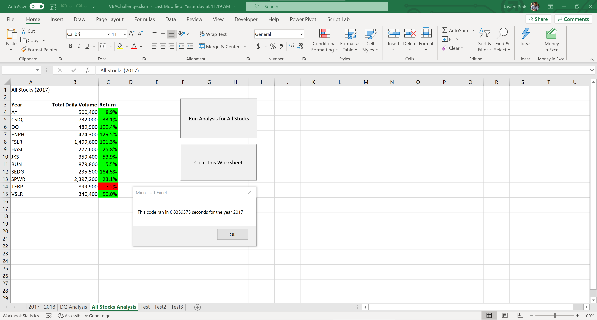
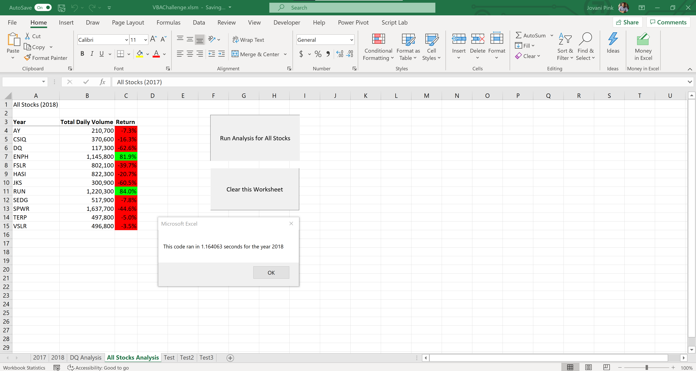

# Stock Analysis

> Playing with VBA for automating data analysis of stock data calculations.

## Table of Contents

- [Overview](#Overview)
- [Results](#Results)
- [Summary](#Summary)
- [Extra](#Extra)
- [Todo Checklist](#TodoChecklist)
- [Contributing](#Contributing)
- [License](#License)

## Overview

We wanted to help a friend do some analysis on some stocks that his client were interested in. We were given the stock information of two years (2017 & 2018) of 'Green Stocks.'

We first looked through the data and focused on one stock ticker to work out the logic of the script we wanted to automate repetitive tasks of:

    - Find the total volume for the current ticker in the row.
    - Find the starting price for the current ticker.
    - Find the ending price for the current ticker.
    - Find the percentage change of the starting and ending price.

We had to loop through through the 3000 plus rows of stock data to out put the ticker volume and find the total volume for the current ticker. However, it just wasn't one ticker stock that we were looking into - we had many. So investing time in developing a VBA macro script would bring us value.

## Results

Committed in our shared repo is the refactored VBA script (VBA_Challenge.vbs) we used to create:

#### 2017

#### 2018

## Summary

NEED TO FINISH!

## Extra

Beyond VBA ... I wanted to translate the VBA macros to the new JavaScript API: - [Excel add-ins documentation](https://docs.microsoft.com/en-us/office/dev/add-ins/excel/) - [Excel JavaScript API overview](https://docs.microsoft.com/en-us/office/dev/add-ins/reference/overview/excel-add-ins-reference-overview) - [Work with worksheets using the Excel JavaScript API](https://docs.microsoft.com/en-us/office/dev/add-ins/excel/excel-add-ins-worksheets) - [Work with tables using the Excel JavaScript API](https://docs.microsoft.com/en-us/office/dev/add-ins/excel/excel-add-ins-tables) - [Work with ranges using the Excel JavaScript API](https://docs.microsoft.com/en-us/office/dev/add-ins/excel/excel-add-ins-ranges)

## Todo Checklist

A helpful checklist to gauge how your README is coming on what I would like to finish:

- [ ] Fill in the three major analysis sections. :)
- [ ] Create a new worksheet that pulls in the CSV files as data to be worked on.
- [ ] Use the 'green_stocks_javascript.xlsx' as the Excel JavaScript API playground.

## Contributing

Pull requests are welcome. For major changes, please open an issue first to discuss what you would like to change.

Please make sure to update tests as appropriate.

## License

[MIT](https://choosealicense.com/licenses/mit/)
